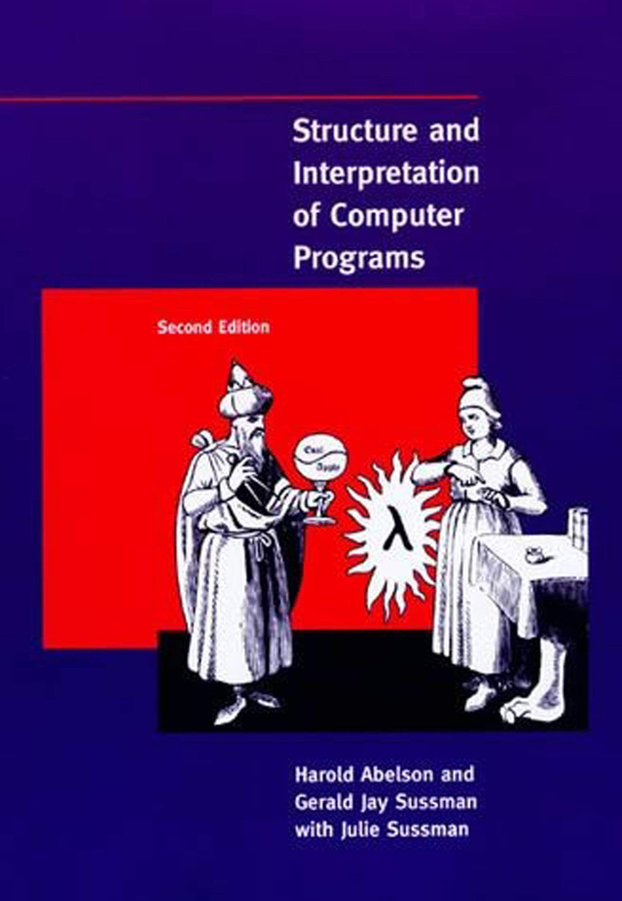

<h1 align="center">
SICP Experiments
</h1>

          

Programs written as I make my way through Sussman and Abelson's Structure and Interpretation of Computer Programs.
An online copy of the book with nice typeset can be found [here](https://sarabander.github.io/sicp/). 

          

## Tested On
All programs have been made using and tested on MIT/GNU Scheme.

## Installation
More details on installing MIT/GNU Scheme can be found [here](https://www.gnu.org/software/mit-scheme/). An easier route would be to use Racket and the associated SICP package.
More details on using Racket for SICP can be found [here](). 

## Roadmap

- [ ]  Eventually complete the book!
